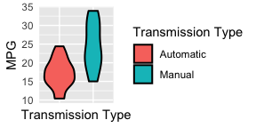
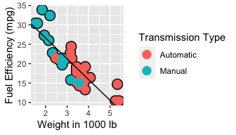
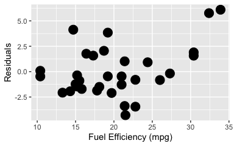
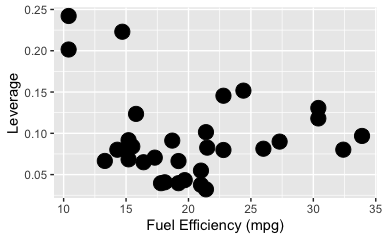
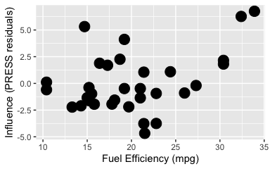

Motor Trend
================
Vimal Simha

### Executive Summary

We analyse data for 32 automobiles to determine whether manual or automatic transmission is more fuel efficient, and to determine the best precitors for fuel efficiency. Automobiles with manual transmission appear to be more fuel efficient than those with automatic transmission. However, the 7.2 mpg difference in fuel efficiency between automobiles with automatic transmission and manual transmission in this sample is fully explained by other factors like automobile weight. At fixed automobile weight, there is no difference in fuel efficiency between vehicles with manual and automatic transmission. Fuel efficiency is principally determined by automobile weight and the number of cylinders: each ton of additional weight reduces fuel efficiency by 6.4 miles per gallon (mpg) and each additional cylinder reduces fuel efficiency by 1.5 mpg.

### Exploratory Analysis



The above figure shows the range of mpg values for manual and automatic transmission. We perform a linear regression with fuel efficiency (mpg) as outcome and transmission mechanism as predictor, finding that the mean fuel efficiency for vehicles with manual transmission is 24.4 mpg compared to 17.2 mpg for vehicles with automatic transmission, and the difference is statistically significant as evidenced by a t-test p-value less than 0.05.

### Including Other Variables

However, this analysis disregards the effect of other factors that affect fuel efficiency besides transmission mechanism. In the appendix, we show the correlations between fuel efficiency and all other parameters in our dataset. The most strongly correlated variable is vehicle weight, so we fit a linear regression model with fuel efficiency (mpg) as outcome, transmission mechanism as predictor and weight as confounder.

``` r
summary(lm(mpg ~ factor(am) + wt, data = mtcars))$coeff
```

    ##                Estimate Std. Error     t value     Pr(>|t|)
    ## (Intercept) 37.32155131  3.0546385 12.21799285 5.843477e-13
    ## factor(am)1 -0.02361522  1.5456453 -0.01527855 9.879146e-01
    ## wt          -5.35281145  0.7882438 -6.79080719 1.867415e-07

At fixed weight, transmission mechanism has no effect on fuel efficiency as indicated by our p-value of 0.99.



High weight automatic transmission vehicles and low weight manual transmission vehicles are outliers with higher than average fuel efficiency. In our dataset, low weight vehicles have manual transmission and high weight vehicles have automatic transmission, so we do not fit separate lines for either type of transmission.

### Identifying Predictors of Fuel Efficiency

We identify the quantities that best predict fuel efficiency. We use a nested likelihood ratio test for model selection. We start with a simple model that uses the variable that is most strongly correlated (or anti-correlated) with fuel efficiency (mpg) as predictor, and successively add variables in order of their absolute value of correlation with fuel efficiency (mpg).

We find that weight and the number of cylinders are predictors of fuel efficiency (mpg), and other variables are not necessary to explain the variation in fuel efficiency at 95% confidence.

``` r
summary(fit <- lm(mpg ~ wt + cyl, data = mtcars))$coeff
```

    ##              Estimate Std. Error   t value     Pr(>|t|)
    ## (Intercept) 39.686261  1.7149840 23.140893 3.043182e-20
    ## wt          -3.190972  0.7569065 -4.215808 2.220200e-04
    ## cyl         -1.507795  0.4146883 -3.635972 1.064282e-03

Each ton of additional weight reduces fuel efficiency by 6.4 mpg and each additional cylinder reduces fuel efficiency by 1.5 mpg.

Residuals
---------



Our model residuals, plotted against fuel efficiency (mpg) do not show any discernable pattern. We also show leverage and PRESS residuals in the Appendix which reinforce our conclusion.

### APPENDIX

Correlations
------------

Correlation between fuel efficiency and other variables

``` r
cor(mtcars)[,1]
```

    ##        mpg        cyl       disp         hp       drat         wt       qsec 
    ##  1.0000000 -0.8521620 -0.8475514 -0.7761684  0.6811719 -0.8676594  0.4186840 
    ##         vs         am       gear       carb 
    ##  0.6640389  0.5998324  0.4802848 -0.5509251

Single Variable Regression Model
--------------------------------

We perform a linear regression with fuel efficiency (mpg) as outcome and transmission mechanism as predictor.

``` r
summary(lm(mpg ~ factor(am), data = mtcars))$coeff
```

    ##              Estimate Std. Error   t value     Pr(>|t|)
    ## (Intercept) 17.147368   1.124603 15.247492 1.133983e-15
    ## factor(am)1  7.244939   1.764422  4.106127 2.850207e-04

Nested Likelihood Ratio Test
----------------------------

``` r
fit1 <- lm(mpg ~ wt, data = mtcars)
fit2 <- update(fit, mpg ~ wt + cyl, data = mtcars)
fit3 <- update(fit, mpg ~ wt + cyl + disp, data = mtcars)
fit4 <- update (fit, mpg ~ wt + cyl + disp + hp, data = mtcars)
fit5 <- update (fit, mpg ~ wt + cyl + disp + hp + drat, data = mtcars)
fit6 <- update (fit, mpg ~ wt + cyl + disp + hp + drat + vs, data = mtcars)
fit7 <- update (fit, mpg ~ wt + cyl + disp + hp + drat + vs + am , data = mtcars)
fit8 <- update (fit, mpg ~ wt + cyl + disp + hp + drat + vs + am + carb, data = mtcars)
fit9 <- update (fit, mpg ~ wt + cyl + disp + hp + drat + vs + am + carb + gear, data = mtcars)
fit10 <- update (fit, mpg ~ wt + cyl + disp + hp + drat + vs + am + carb + gear + qsec, data = mtcars)
anova(fit1,fit2,fit3,fit4,fit5, fit6, fit7, fit8, fit9,fit10)
```

    ## Analysis of Variance Table
    ## 
    ## Model  1: mpg ~ wt
    ## Model  2: mpg ~ wt + cyl
    ## Model  3: mpg ~ wt + cyl + disp
    ## Model  4: mpg ~ wt + cyl + disp + hp
    ## Model  5: mpg ~ wt + cyl + disp + hp + drat
    ## Model  6: mpg ~ wt + cyl + disp + hp + drat + vs
    ## Model  7: mpg ~ wt + cyl + disp + hp + drat + vs + am
    ## Model  8: mpg ~ wt + cyl + disp + hp + drat + vs + am + carb
    ## Model  9: mpg ~ wt + cyl + disp + hp + drat + vs + am + carb + gear
    ## Model 10: mpg ~ wt + cyl + disp + hp + drat + vs + am + carb + gear + qsec
    ##    Res.Df    RSS Df Sum of Sq       F   Pr(>F)   
    ## 1      30 278.32                                 
    ## 2      29 191.17  1    87.150 12.4083 0.002022 **
    ## 3      28 188.49  1     2.680  0.3815 0.543434   
    ## 4      27 170.44  1    18.048  2.5696 0.123868   
    ## 5      26 167.43  1     3.018  0.4297 0.519238   
    ## 6      25 166.82  1     0.609  0.0867 0.771270   
    ## 7      24 158.65  1     8.163  1.1622 0.293241   
    ## 8      23 157.22  1     1.440  0.2050 0.655367   
    ## 9      22 156.36  1     0.856  0.1219 0.730480   
    ## 10     21 147.49  1     8.864  1.2621 0.273941   
    ## ---
    ## Signif. codes:  0 '***' 0.001 '**' 0.01 '*' 0.05 '.' 0.1 ' ' 1

Residual Analysis
-----------------

The figure below shows a plot of leverage against fuel efficiency (mpg) for our best model.



The figure below shows a plot of influence, as measured by PRESS residuals, the difference in the response and the predicted response at each data point, where it was not included in the model fitting, against fuel efficiency (mpg) for our best model.


